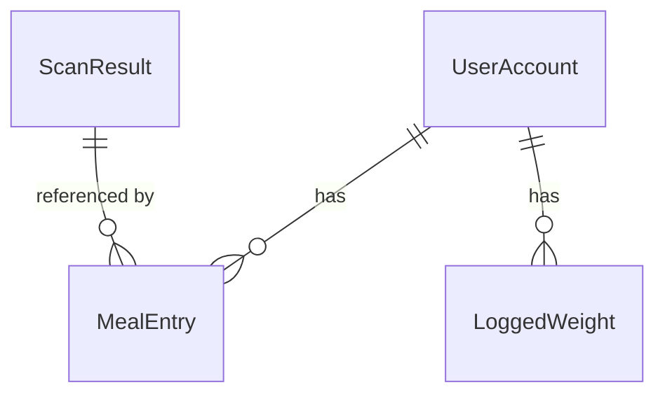

# NutriSight Database - Entity Relationship Diagram (ERD)

## Visual ERD

```
┌─────────────────────────────────────────────────────────────────────┐
│                          USER ACCOUNT                                │
├─────────────────────────────────────────────────────────────────────┤
│ PK: _id (ObjectId)                                                   │
│                                                                       │
│ gmailId (string, unique, sparse)                                     │
│ profileLink (string)                                                 │
│ profilePublicId (string)                                             │
│ email (string, unique)                                               │
│ password (string, hashed)                                            │
│ firstName (string)                                                   │
│ lastName (string)                                                    │
│ name (string)                                                        │
│ gender (string)                                                      │
│ birthDate (Date)                                                     │
│ heightFeet (number)                                                  │
│ heightInches (number)                                                │
│ weight (number)                                                      │
│ weightGoal (string)                      ┌──────────────────────┐   │
│ targetWeight (number)                    │   Has Many           │   │
│ bmi (number)                             └──────────────────────┘   │
│ allergens (string[])                              │                  │
│ medicalConditions (string[])                      │                  │
│ dietType (string)                                 │                  │
│ activityLevel (string)                            ▼                  │
│ dailyRecommendation:                    ┌─────────────────────┐     │
│   - calories (number)                   │   LOGGED WEIGHT     │     │
│   - protein (number)                    ├─────────────────────┤     │
│   - carbs (number)                      │ PK: _id (ObjectId)  │     │
│   - fat (number)                        │ FK: userId          │────►│
│ otp (string)                            │                     │     │
│ otpExpires (Date)                       │ value (number)      │     │
│ isVerified (boolean)                    │ date (string)       │     │
│ loginAttempts (number)                  │ createdAt (Date)    │     │
│ lockUntil (Date)                        └─────────────────────┘     │
└─────────────────────────────────────────────────────────────────────┘
                │
                │ Has Many
                ▼
┌─────────────────────────────────────────────────────────────────────┐
│                          MEAL ENTRY                                  │
├─────────────────────────────────────────────────────────────────────┤
│ PK: _id (ObjectId)                                                   │
│ FK: userId (ObjectId) ────────────────────────────► UserAccount     │
│ FK: scanResultId (ObjectId) ──────────┐                             │
│                                        │                             │
│ date (string "YYYY-MM-DD")             │                             │
│ mealType (enum):                       │                             │
│   - breakfast                          │                             │
│   - lunch                              │                             │
│   - dinner                             │                             │
│   - otherMealTime                      │                             │
│ quantity (number)                      │                             │
│ triggeredAllergens:                    │                             │
│   - ingredient (string)                │                             │
│   - allergen (string)                  │                             │
│ createdAt (Date)                       │                             │
│                                        │                             │
│ Indexes:                               │                             │
│   - userId + date                      │                             │
│   - userId + date + mealType           │                             │
└────────────────────────────────────────┼─────────────────────────────┘
                                         │
                                         │ References
                                         ▼
┌─────────────────────────────────────────────────────────────────────┐
│                        SCAN RESULT                                   │
├─────────────────────────────────────────────────────────────────────┤
│ PK: _id (ObjectId)                                                   │
│                                                                       │
│ name (string)                                                        │
│ foodName (string)                                                    │
│ brand (string)                                                       │
│ servingSize (string, required)                                       │
│ ingredients (string[])                                               │
│ nutritionData:                                                       │
│   - title (string)                                                   │
│   - items:                                                           │
│       * name (string)                                                │
│       * value (number)                                               │
│       * unit (string)                                                │
│ source (string)                                                      │
│   - "usda" | "nutritionix" | "open food facts" | "gemini"           │
│ sourceId (string)                                                    │
│ createdAt (Date)                                                     │
│ updatedAt (Date)                                                     │
│                                                                       │
│ Indexes:                                                             │
│   - sourceId + source (deduplication)                                │
│   - name + brand                                                     │
└─────────────────────────────────────────────────────────────────────┘
```

---

## Detailed Relationship Descriptions

### 1. UserAccount ↔ MealEntry (One-to-Many)

- **Relationship**: One user has many meal entries
- **Foreign Key**: `MealEntry.userId` → `UserAccount._id`
- **Cardinality**: 1:N
- **Delete Behavior**: If user deleted → cascade delete all meal entries
- **Business Rule**: Users track their daily meals across different meal times

### 2. UserAccount ↔ LoggedWeight (One-to-Many)

- **Relationship**: One user has many logged weights
- **Foreign Key**: `LoggedWeight.userId` → `UserAccount._id`
- **Cardinality**: 1:N
- **Delete Behavior**: If user deleted → cascade delete all logged weights
- **Business Rule**: Users track their weight over time
- **Constraint**: Unique combination of `userId + date` (one weight per day)

### 3. ScanResult ↔ MealEntry (One-to-Many)

- **Relationship**: One scan result (food item) can be used in many meal entries
- **Foreign Key**: `MealEntry.scanResultId` → `ScanResult._id`
- **Cardinality**: 1:N
- **Delete Behavior**: Protect (cannot delete scan result if referenced by meal entries)
- **Business Rule**: Same food scanned by multiple users or same user multiple times references single ScanResult

---

## Database Normalization Level: **3NF (Third Normal Form)**

### Why 3NF?

1. **1NF** ✅ - All attributes contain atomic values (no arrays of complex objects in base tables)
2. **2NF** ✅ - All non-key attributes depend on the entire primary key
3. **3NF** ✅ - No transitive dependencies (non-key attributes don't depend on other non-key attributes)

### Denormalization Exceptions (By Design)

- **`dailyRecommendation`** embedded in UserAccount (calculated from user profile, frequently accessed)
- **`nutritionData`** embedded in ScanResult (complex nested structure, always retrieved together)
- **`triggeredAllergens`** embedded in MealEntry (specific to this meal instance, not shared data)

---

## Indexes Strategy

### UserAccount

```javascript
{
  email: 1;
} // unique
{
  gmailId: 1;
} // unique, sparse
```

### MealEntry

```javascript
{ userId: 1, date: -1 } // fetch user's diet history by date
{ userId: 1, date: 1, mealType: 1 } // fetch specific meal type for a date
{ scanResultId: 1 } // lookup meals using a specific food
```

### LoggedWeight

```javascript
{ userId: 1, date: -1 } // unique, fetch user's weight history
```

### ScanResult

```javascript
{ sourceId: 1, source: 1 } // sparse, deduplication check
{ name: 1, brand: 1 } // alternative deduplication check
```

---

## Sample Queries

### Get User's Diet History for a Date

```javascript
// Populate meal entries with food details
MealEntry.find({ userId, date: "2025-01-15" }).populate("scanResultId").exec();
```

### Get All Foods a User Has Eaten

```javascript
MealEntry.find({ userId }).populate("scanResultId").distinct("scanResultId");
```

### Get Most Popular Foods Across All Users

```javascript
MealEntry.aggregate([
  { $group: { _id: "$scanResultId", count: { $sum: 1 } } },
  { $sort: { count: -1 } },
  { $limit: 10 },
  {
    $lookup: {
      from: "scanresults",
      localField: "_id",
      foreignField: "_id",
      as: "food",
    },
  },
]);
```

### Get User's Weight Tracking Over Time

```javascript
LoggedWeight.find({ userId }).sort({ date: -1 }).limit(30);
```

---

## Data Integrity Rules

### Constraints

1. **Email must be unique** (UserAccount)
2. **One weight log per user per day** (LoggedWeight: unique userId + date)
3. **ScanResult deduplication** by sourceId + source OR name + brand
4. **MealEntry must reference valid UserAccount and ScanResult**
5. **Date format must be "YYYY-MM-DD"** (MealEntry.date, LoggedWeight.date)

### Validation

- **mealType** must be one of: breakfast, lunch, dinner, otherMealTime
- **quantity** must be > 0
- **weight value** must be > 0
- **servingSize** is required in ScanResult

---

## Storage Estimates

### Assumptions (1000 users, 1 year)

- Average 3 meals per day per user
- Average 1 weight log per week per user
- Average 500 unique foods scanned

| Collection   | Documents     | Avg Size | Total Size   |
| ------------ | ------------- | -------- | ------------ |
| UserAccount  | 1,000         | 2 KB     | 2 MB         |
| MealEntry    | 1,095,000     | 1 KB     | 1.1 GB       |
| LoggedWeight | 52,000        | 0.1 KB   | 5.2 MB       |
| ScanResult   | 500           | 5 KB     | 2.5 MB       |
| **Total**    | **1,148,500** |          | **~1.11 GB** |

---

## Migration Path (Already Complete! ✅)

1. ✅ Created new normalized models (ScanResult, MealEntry, LoggedWeight)
2. ✅ Updated controllers to use normalized tables
3. ✅ Created utility functions to rebuild old response format
4. ✅ Maintained API backward compatibility
5. ✅ Database cleaned (no migration needed)

---

## Future Optimization Opportunities

### Caching Strategy

```javascript
// Cache populated user data in Redis
const cachedUser = await redis.get(`user:${userId}`);
if (!cachedUser) {
  const user = await populateUserWithDynamicData(userObj);
  await redis.setex(`user:${userId}`, 300, JSON.stringify(user)); // 5 min TTL
}
```

### Pagination for Large Histories

```javascript
// Limit diet history to last 30 days
MealEntry.find({
  userId,
  date: { $gte: thirtyDaysAgo },
});
```

### Materialized View for Analytics

```javascript
// Pre-aggregate popular foods daily
db.createCollection("popularFoods", { viewOn: "mealentries" });
```

---

## ERD Tools (Visual Diagram)

To create a visual ERD diagram, you can use:

1. **dbdiagram.io** - Paste this schema:

```
Table UserAccount {
  _id ObjectId [pk]
  email String [unique]
  password String
  firstName String
  lastName String
  // ... other fields
}

Table MealEntry {
  _id ObjectId [pk]
  userId ObjectId [ref: > UserAccount._id]
  scanResultId ObjectId [ref: > ScanResult._id]
  date String
  mealType Enum
  quantity Number
}

Table LoggedWeight {
  _id ObjectId [pk]
  userId ObjectId [ref: > UserAccount._id]
  value Number
  date String

  Indexes {
    (userId, date) [unique]
  }
}

Table ScanResult {
  _id ObjectId [pk]
  name String
  brand String
  servingSize String
  source String
  sourceId String
}
```

2. **Draw.io** / **Lucidchart** - Import the ASCII diagram above

3. **Mermaid** (for markdown/GitHub):



---

Your normalized database is production-ready! 🎉
